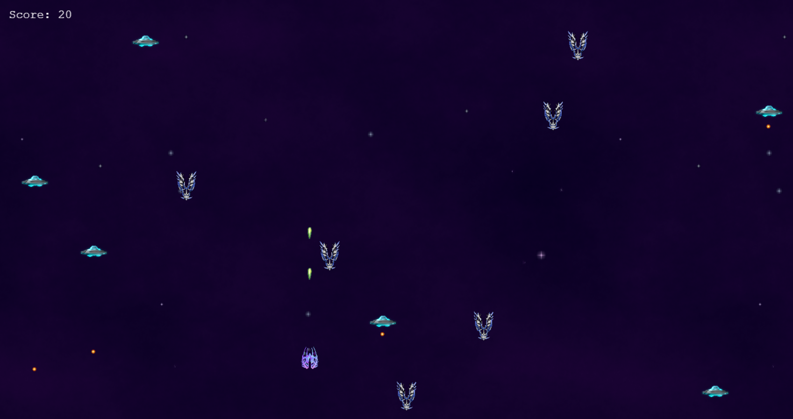

# Space shooter capstone project

This project consisted of building a shooter game that you can play on the browser using Phaser 3 library (JavaScript).

## What is this project about? 

 You are a space ship which is in the middle of a universe war and you have one objective: to destroy as many enemies as you can. You will have to cross the universe with the help of your laser shooter, avoiding being hit by the enemies or their lasers. This is an endless war so you have the opportunity to fight as long as you keep yourself alive.

## Built with: 
- HTML5
- [Phaser 3](https://phaser.io/phaser3)
- Vanilla JavaScript

### Tools

- [npm](https://www.npmjs.com/)
- [Jest](https://jestjs.io/es-ES/)
- [ESlint](https://eslint.org/)
- [Webpack](https://webpack.js.org/)

**Instructions**

The player can:
- Move to the right, left, upwards, and downwards across the game's screen using arrow keys.
- Shoot enemies by pressing the Spacebar key.
The enemies can: 
- Shoot player

The player's score will increase by 10 points every time he destroys an enemy. 
The game is over when the player gets shot or collides with an enemy.

## Live demo link

[Space shooter]()

## How to use this app locally?

**Pre-requisites**

- Having [NodeJS](https://nodejs.org/en/) installed on your machine.

### Setting up instructions 

**In case you use Git**

1. Open terminal 

2. Run the following commands:

`git clone https://github.com/Abhigyan001/Survive.git`

`cd Survive`

`npm install`

3. Open index.html using a web server.

**In case you don't use a control version system**

1. Go to [the repository](https://github.com/Abhigyan001/Survive.git)

2. Press the green button that says "Code".

3. Press "Download zip".

4. Once downloaded, extract the files.

5. Right click on the folder, press "Open in terminal".

6. Run:

`npm install`

7. Open index.html using a web server.

### Running tests
 
1. Open terminal

2. Run:

`npm run test`

## Author 

👤 **Abhigyan Mahanta**
​

- Github: [@githubhandle](https://github.com/Abhigyan001)
- 
- Linkedin: [Linkedin Profile](https://www.linkedin.com/in/abhigyan001/)

- Twitter: [@Twitter](https://twitter.com/abhigyan_001)

## Contributing 

- To contribute to this project:
- Fork this repository & clone locally.
- Create an upstream remote and sync your local copy.
- Create a new branch.
- Push your code to your origin repository.
- Create a new Pull Request .

## Show your support

Give a ⭐️ if you like this project!
​

## Acknowledgments

- Microverse curriculum.